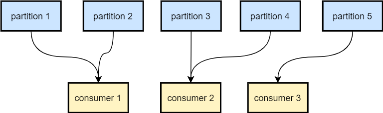
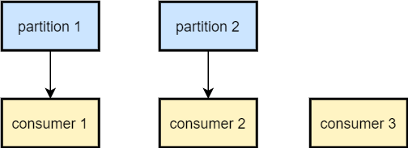
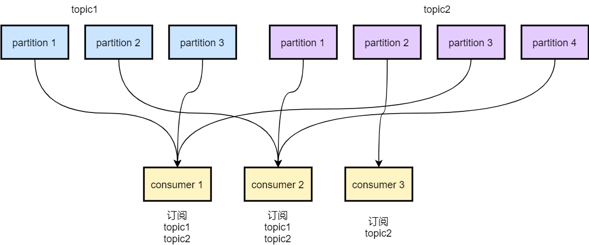

# 顺序消费

kafka可以保证同一个分区消息有序，即和生产者写入的顺序保持一致。
因此Kafka顺序消费的前提是发送和订阅同一个分区，并且保证生产者写入broker的顺序有序且消费者消费的顺序有序。

#### 发送和订阅同一个分区
##### 生产者的分区策略
1. 如果指定了分区，则发送到指定分区
2. 如果没有指定分区但指定了key，则根据key的hash值选择分区
3. 如果即没有指定分区也没有key，则轮询选择分区

因此，如果需要消息发送到同一个分区，需要发送时指定分区或者指定相同的key。

##### 消费者的分区策略
1. RangeAssignor(默认) 
    源码见 org.apache.kafka.clients.consumer.RangeAssignor#assign  
    
    每个topic单独分配分区，不同topic之间互相不影响。  
    每个消费者分到的分区数量为 partition_num / consumer_num，如果分区数大于消费者数量，则前面的分区再加上  (partition_num % consumer_num) / consumer_num；
    如果分区数量小于消费者数量，则部分消费者将空闲。
    
    分区数 > 消费者数量的情况:  
    
    
    分区数 < 消费者数量的情况:  
    

2. RoundRobinAssignor
    源码见 org.apache.kafka.clients.consumer.RoundRobinAssignor#assign
    
    所有topic分区一起分配给所有消费者，包括未订阅该topic的消费者。
    topic分区组成一个列表，所有消费者组成一个列表，分区依次顺序非给消费者，如果分到该消费者时未订阅topic，则跳过该消费者继续进行。
    
    假设有两个topic，topic1有三个分区，topic2有4个分区，有3个consumer，consumer1和consumer2订阅topic1和topic2，consumer3仅订阅topic2，分区分配如下  
    

3. StickyAssignor
    源码见org.apache.kafka.clients.consumer.StickyAssignor
    
    遵循两个原则: a. 分配均匀 b. 重分配时尽可能和上次相同 如果a和b冲突优先遵从a
    具体原理待分析
    
    
max.in.flight.requests.per.connection 指定了生产者在收到服务器响应之前可以发送多少条消息  
retries 指定了生产者发送消息异常可以重发的次数  

结合以上两条参数，如果retries > 0 且max.in.flight.requests.per.connection > 1，则生产者在重发第一条失败的消息时，发送的第二条消息可能先到达broker，而导致了乱序。
因此若要保证生产者写入broker的顺序有序，需要将retries设置为0(不推荐，会导致消息丢失)或是将max.in.flight.requests.per.connection设为1。  

严格保证Kakfa消息有序会极大限制其吞吐量，并不推荐。可以采用内存队列来保证顺序消费。